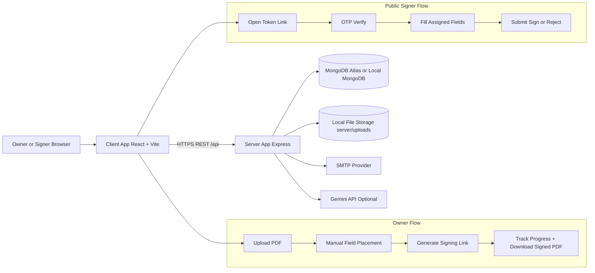

# SignatureFlow

Enterprise-ready digital document signing platform built with React, TypeScript, Node.js, Express, and MongoDB.

This repository contains both client and server apps for end-to-end e-sign workflows, including owner-side field placement, tokenized external signing, OTP verification, audit logs, and signed PDF generation.

## 1. What This Project Does

SignatureFlow allows teams to:

- Upload PDF documents
- Add signers (single or multi-signer, ordered)
- Manually drag and drop signing fields on the PDF (no automatic field placement)
- Generate secure signing links for external users
- Collect signatures, initials, text fields, date, name, and company stamps
- Verify signer identity with OTP before signing
- Produce tamper-evident signed PDFs
- Track complete document activity through audit trails

## 2. Key Product Behavior (Final)

- Fields are not auto-added on upload.
- Document owners place fields manually in the editor.
- Public signers only see fields assigned to their signer order.
- Required fields are enforced before signing.
- Downloaded signed PDFs include placed signature artifacts plus text-like fields used during signing/finalize.

## 3. Core Features

- JWT authentication with refresh flow
- Owner dashboard with status filters and signer progress
- PDF rendering in browser
- Drag-and-drop field placement with resizing and signer assignment
- Signature modal with typed, drawn, uploaded modes (signature, initials, stamp)
- Public signing page with required/optional field handling
- OTP send/verify before public signing
- Sequential multi-signer routing and link management
- Audit logs for major events (open, sign, reject, download, etc.)
- AI document analysis endpoints (Gemini + fallback controls)

## 4. Tech Stack

- Frontend: React 18, TypeScript, Vite, React Router, Axios
- UI: Tailwind CSS, Lucide icons, React Hot Toast
- PDF UX: PDF.js, React PDF helpers
- Backend: Node.js, Express
- Database: MongoDB, Mongoose
- Auth/Security: JWT, bcryptjs, helmet, CORS, rate limit
- Storage/Files: Multer local storage under server/uploads
- Email: Nodemailer (SMTP or mock logging in dev)
- PDF Generation: pdf-lib
- AI: @google/generative-ai

## 5. Monorepo Structure

.
|-- client/
|   |-- src/
|   |   |-- components/
|   |   |-- pages/
|   |   |-- services/
|   |   |-- context/
|   |   |-- types/
|   |   `-- utils/
|   `-- package.json
|-- server/
|   |-- controllers/
|   |-- routes/
|   |-- models/
|   |-- middleware/
|   |-- services/
|   |-- utils/
|   |-- uploads/
|   `-- package.json
|-- DEPLOYMENT.md
|-- package.json
`-- README.md

## 6. Local Development Setup

Prerequisites:

- Node.js 18+
- MongoDB local instance or MongoDB Atlas

Install dependencies:

1. At repository root, run npm install
2. Run npm run install:all

Start local development:

1. Run npm run dev from root
2. Frontend default: http://localhost:5173
3. Backend default: http://localhost:5000

Root scripts:

- npm run dev
- npm run dev:server
- npm run dev:client
- npm run install:all

## 7. Environment Variables

Create server/.env and configure the following keys.

Required:

- PORT
- MONGODB_URI
- JWT_SECRET
- CLIENT_URL

Recommended auth/session keys:

- JWT_EXPIRE
- JWT_REFRESH_SECRET
- JWT_REFRESH_EXPIRE

Email/OTP keys:

- EMAIL_HOST
- EMAIL_PORT
- EMAIL_SECURE
- EMAIL_USER
- EMAIL_PASS

AI keys (optional but recommended):

- GEMINI_API_KEY
- GEMINI_MODEL
- AI_MAX_INPUT_CHARS
- AI_MAX_OUTPUT_TOKENS
- AI_MAX_RETRIES_429
- AI_ENABLE_HEURISTIC_FALLBACK

Notes:

- If SMTP keys are missing, email services run in mock mode and log payloads.
- CLIENT_URL must match the frontend origin used by sign links.

## 8. Main Workflows

### 8.1 Owner Workflow

1. Register/login
2. Upload PDF
3. Open document editor
4. Drag and drop fields manually
5. Save fields
6. Generate signing link with signer list
7. Monitor signer progress
8. Download final signed document

### 8.2 Public Signer Workflow

1. Open tokenized sign link
2. Request OTP
3. Verify OTP
4. Fill assigned fields and apply signatures
5. Submit sign (or reject)
6. System advances to next signer (if sequential)

### 8.3 Finalization Workflow (Owner)

When owner finalizes from editor, server embeds:

- Signature/initials/stamp artifacts
- Name/date/text field values

Result is stored as signedFilePath and used by download endpoint.

## 9. API Overview

Base server path: /api

Auth:

- POST /auth/register
- POST /auth/login
- POST /auth/refresh
- POST /auth/logout
- GET /auth/profile

Documents:

- POST /docs/upload
- GET /docs
- GET /docs/:id
- GET /docs/:id/signers
- PUT /docs/:id/fields
- POST /docs/:id/signing-link
- GET /docs/:id/download
- DELETE /docs/:id

Signatures:

- POST /signatures
- GET /signatures/:id
- POST /signatures/finalize

Audit:

- GET /audit/:docId

Public:

- GET /public/sign/:token
- POST /public/sign/:token
- POST /public/otp/send
- POST /public/otp/verify

AI:

- POST /ai/analyze/:id
- POST /ai/analyze-public/:token

Health check:

- GET /api/health

## 10. Data Model Summary

Document includes:

- owner, title, file metadata
- status: pending, signed, rejected, expired
- signers array with order, status, token, signedAt, rejection info
- signatureFields array with type, signerOrder, position, dimensions, required, value
- signedFilePath and completion metadata

Field types:

- signature
- initials
- stamp
- name
- date
- text

## 11. Security and Compliance Controls

- JWT-protected owner APIs
- Bcrypt password hashing
- Helmet security headers
- CORS allowlist via CLIENT_URL and CLIENT_URLS
- OTP gate for public signing
- Token expiry on signing links
- Signer IP and user-agent capture in audit logs
- Server-side PDF rendering and output generation

## 12. Deployment

See DEPLOYMENT.md for deployment paths.

Typical production split:

- Backend on Render (or any Node host)
- Frontend on Vercel (or any static host)
- MongoDB Atlas for database

Production checklist:

1. Set all required env values
2. Configure CLIENT_URL correctly
3. Set CLIENT_URLS for all allowed frontend origins
4. Set client `VITE_API_URL` to your backend `/api` URL
5. Ensure uploads persistence strategy for your host
6. Configure SMTP for real email/OTP delivery
7. Enable HTTPS and secure domains

## 13. Troubleshooting

Port already in use:

- Change PORT in server/.env or stop existing process

Cannot login with old account:

- Verify MONGODB_URI points to the intended database

Fields not appearing in old documents:

- Older records may still contain saved fields; clear/update fields in editor

Signed PDF missing latest edits:

- Save fields and re-finalize to regenerate signed output

Public signer blocked before signing:

- Ensure OTP is verified and token is not expired

## 14. Project Status

Current codebase is in final handoff state with:

- Manual field placement workflow
- Working owner and public signing paths
- Signed PDF generation with text and signature artifacts
- OTP verification and audit trail

This README is the primary technical handoff document for maintenance and future enhancements.

## 15. Architecture Diagram



## 16. API Request and Response Examples

### 16.1 Upload Document

Request:

```bash
curl -X POST http://localhost:5000/api/docs/upload \
	-H "Authorization: Bearer <access_token>" \
	-F "pdf=@./sample.pdf" \
	-F "title=Employment Agreement" \
	-F 'signers=[{"name":"Alice","email":"alice@example.com","order":1},{"name":"Bob","email":"bob@example.com","order":2}]'
```

Response (201):

```json
{
	"document": {
		"_id": "66f0c7...",
		"title": "Employment Agreement",
		"status": "pending",
		"signatureFields": [],
		"signers": [
			{ "name": "Alice", "email": "alice@example.com", "order": 1, "status": "pending" },
			{ "name": "Bob", "email": "bob@example.com", "order": 2, "status": "pending" }
		]
	}
}
```

### 16.2 Save Manual Fields

Request:

```bash
curl -X PUT http://localhost:5000/api/docs/<doc_id>/fields \
	-H "Authorization: Bearer <access_token>" \
	-H "Content-Type: application/json" \
	-d '{
		"fields": [
			{
				"id": "field-1",
				"type": "signature",
				"signerOrder": 1,
				"x": 18,
				"y": 62,
				"width": 200,
				"height": 80,
				"page": 1,
				"required": true,
				"label": "Signer 1 Signature"
			}
		]
	}'
```

### 16.3 Generate Signing Link

Request:

```bash
curl -X POST http://localhost:5000/api/docs/<doc_id>/signing-link \
	-H "Authorization: Bearer <access_token>" \
	-H "Content-Type: application/json" \
	-d '{
		"signers": [
			{"name":"Alice","email":"alice@example.com","order":1},
			{"name":"Bob","email":"bob@example.com","order":2}
		],
		"message": "Please review and sign"
	}'
```

Response (200):

```json
{
	"signingLink": "http://localhost:5173/sign/8f1a...",
	"token": "8f1a...",
	"document": {
		"_id": "66f0c7...",
		"status": "pending",
		"currentSignerIndex": 0
	}
}
```

### 16.4 OTP Send and Verify

Send OTP:

```bash
curl -X POST http://localhost:5000/api/public/otp/send \
	-H "Content-Type: application/json" \
	-d '{"token":"<signing_token>"}'
```

Verify OTP:

```bash
curl -X POST http://localhost:5000/api/public/otp/verify \
	-H "Content-Type: application/json" \
	-d '{"token":"<signing_token>","otp":"123456"}'
```

### 16.5 Public Sign Submit

Request:

```bash
curl -X POST http://localhost:5000/api/public/sign/<signing_token> \
	-H "Content-Type: application/json" \
	-d '{
		"signerName": "Alice",
		"signerEmail": "alice@example.com",
		"signatures": [
			{
				"type": "typed",
				"category": "signature",
				"data": "Alice",
				"color": "#111111",
				"fields": [{"fieldId":"field-1","x":18,"y":62,"page":1,"width":200,"height":80}]
			}
		],
		"fieldValues": [
			{
				"fieldId": "field-2",
				"type": "date",
				"value": "29/03/2026",
				"x": 18,
				"y": 72,
				"page": 1,
				"width": 160,
				"height": 38,
				"required": false
			}
		]
	}'
```

Response (200):

```json
{
	"message": "Signature saved. The next signer has been notified.",
	"status": "pending",
	"hasMoreSigners": true,
	"nextSigner": {
		"name": "Bob",
		"email": "bob@example.com",
		"order": 2
	}
}
```

## 17. Release Notes

### v1.0.0 Final Handoff

- Finalized end-to-end owner and public signing workflows
- Enforced manual field placement only (removed automatic field injection)
- Added full editable field support in owner editor
- Included name/date/text values in signed PDF generation
- Added OTP verification gate for public signing
- Stabilized multi-signer sequential routing behavior
- Improved field visibility and editor usability
- Documented deployment, operations, troubleshooting, and API examples in this README
